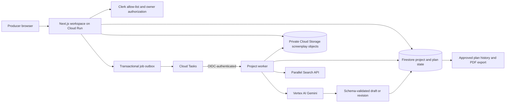

# ScriptOps

**A screenplay change should not force a producer to rebuild the entire plan by hand.**

ScriptOps is a human-supervised pre-production workspace for independent film teams. It turns a screenplay into five connected production artifacts—breakdown, shooting schedule, budget, location recommendations, and casting briefs—then shows the full consequence of a proposed scene change before a producer approves it.

The production app is live at [ScriptOps](https://scriptops-5sinbwmqzq-uc.a.run.app/projects). The self-contained product demonstration remains available at [/demo](https://scriptops-5sinbwmqzq-uc.a.run.app/demo).

## The producer workflow

1. **Create a production.** A producer establishes the project’s planning profile and uploads a PDF or Final Draft (`.fdx`) screenplay.
2. **Review the source.** ScriptOps parses the screenplay into scenes that can be checked and corrected before generation begins.
3. **Build an evidence-backed plan.** Gemini produces a structured initial plan while Parallel Search supplies current production research for the constraints the screenplay actually triggers.
4. **Run a Revision Ripple.** The producer describes a change to a selected scene. ScriptOps shows its proposed consequences across schedule, budget, locations, and casting while the approved baseline remains intact.
5. **Make one clear decision.** The producer approves the complete proposal atomically, discards it, or edits and reruns it. Approved plans are immutable, versioned, and exportable as production PDFs.

## Why Parallel Search matters

ScriptOps is built for the [Parallel track](https://agentic-cinema.devpost.com/). Parallel is part of the planning decision, not a decorative search field.

The server calls Parallel Search through the official `parallel-web` TypeScript SDK with focused production queries for the supported New Mexico pilot profile. It covers the constraints present in the screenplay: permits, costs, child performers, stunts, vehicles, and night work. Results are normalized into cited evidence records, checked for freshness and required-topic coverage, and passed to the downstream planning stages. Budget line items, location recommendations, schedule assumptions, and warnings retain evidence IDs rather than claiming unsupported certainty.

The product exposes the evidence source count, retrieval time, and source links so a producer can assess the basis for a recommendation.

## Architecture



### Design choices

| Concern | How ScriptOps handles it |
| --- | --- |
| Ownership | Clerk identifies an allow-listed user. Every project API and nested resource rechecks that owner before returning or changing data. |
| Long-running work | The browser starts a job; Cloud Tasks invokes the worker separately with a verified Google OIDC identity. Refreshing the browser never owns the work. |
| Evidence | Parallel results are normalized, deduplicated, freshness-checked, and tied to the affected planning outputs. Missing required evidence blocks a plan rather than silently publishing one. |
| AI output | Gemini runs through typed provider boundaries and Zod contracts. Invalid, incomplete, or uncited output cannot become an approved baseline. |
| Producer control | A draft is not a plan. One Firestore transaction installs every artifact in a complete proposal as a new immutable version only after explicit approval. |
| Files and deletion | Screenplay objects use private project prefixes and short-lived upload authorization. Confirmed deletion fences delayed work, removes scoped application data, and leaves a minimal tombstone for recovery control. |

## Stack

- **Application:** Next.js 16 App Router, React 19, TypeScript, Tailwind CSS
- **Agent and AI:** Google ADK, Google Gen AI SDK, Vertex AI Gemini
- **Research:** Parallel Search API via `parallel-web`
- **Google Cloud:** Cloud Run, Firestore, Cloud Tasks, Cloud Storage, Secret Manager, Cloud Scheduler
- **Identity:** Clerk
- **Validation and documents:** Zod and React PDF

## Run locally

### Prerequisites

- Node.js `22.16.0`
- npm `10.9.2`
- A Google Cloud project for live project workflows
- A Parallel API key and Vertex AI access for live planning
- Clerk keys when testing the authenticated production workspace

### Install

```powershell
git clone <your-repository-url>
Set-Location "Agentic Cinema The Blockbuster Hackathon"
npm ci
Copy-Item .env.example .env.local
npm run dev
```

Open [http://localhost:3000](http://localhost:3000). With `PROJECT_WORKSPACES_ENABLED=true`, the root route opens `/projects`; `/demo` always opens the isolated demonstration workspace.

### Configure the runtime

`.env.example` documents every supported setting. Copy it to `.env.local` and supply only the values needed for the path you are exercising.

| Workflow | Required configuration |
| --- | --- |
| Local demo | `DEMO_INSTANCE_COOKIE_SECRET`; Clerk keys are optional for local preview. |
| Authenticated projects | Clerk publishable/secret keys, `CLERK_ALLOWED_USER_IDS`, `PROJECT_WORKSPACES_ENABLED=true`, and Google Cloud project settings. |
| Screenplay upload and parsing | Project workspace settings plus `PROJECT_UPLOAD_BUCKET`, Cloud Tasks configuration, and a service identity able to invoke the worker. |
| Live plan generation | The project workflow settings plus Vertex AI configuration, `PARALLEL_API_KEY`, and explicitly verified planning price ceilings. Set `PROJECT_PLANNING_ENABLED=true` only in an environment prepared for live provider calls. |

Never commit `.env.local`, service-account exports, API keys, or signed upload URLs. Production uses Secret Manager for provider credentials and dedicated service identities for Cloud Run and Cloud Tasks.

## Validate changes

Run the ordinary quality gates from the repository root:

```powershell
npm run lint
npm run typecheck
npm test
npm run build
```

Focused checks are available for the major workflows:

```powershell
npm run verify:post-hackathon:ingestion
npm run verify:post-hackathon:planning
npm run verify:post-hackathon:project-ripple
npm run verify:post-hackathon:project-export
npm run verify:post-hackathon:project-cleanup
```

The production perimeter check is opt-in and requires an explicit base URL:

```powershell
$env:E2E_BASE_URL = "https://scriptops-5sinbwmqzq-uc.a.run.app"
npm run verify:post-hackathon:e2e
```

Provider-backed planning checks are intentionally opt-in because they can incur Gemini and Parallel usage. See [planning verification](docs/post-hackathon/planning-verification.md) before running them.

## Project layout

```text
app/                 Next.js pages and protected route handlers
components/          Producer workspace, review, and project UI
lib/projects/        Ownership, lifecycle, and deletion boundaries
lib/scripts/         Upload, parsing, source coverage, and scene review
lib/planning/        Evidence, Gemini stages, proposals, and approval records
lib/cloud-tasks/     Durable dispatch and worker invocation
lib/pdf/             Approved production-plan exports
infra/               Google Cloud deployment configuration
tests/               Unit, integration, planning, ingestion, and E2E coverage
```

## Production notes

The deployed service runs as Cloud Run service `scriptops` in `us-central1`; Gemini inference is configured for the Vertex AI `global` location. Cloud Tasks is used for durable project work, Firestore is the state authority, and the object bucket has public-access prevention enabled.

ScriptOps is a decision-support tool. It preserves evidence, assumptions, and uncertainty for producer review; it does not claim that locations, permits, rates, access, or availability are confirmed.

## Further reading

- [Functional specification](docs/post-hackathon/functional-spec.md)
- [Technical design](docs/post-hackathon/technical-design.md)
- [Release evidence and open pilot checks](docs/post-hackathon/release-evidence.md)
- [Hackathon build specification](docs/hackathon-build/spec.md)

## License

[MIT](LICENSE)
