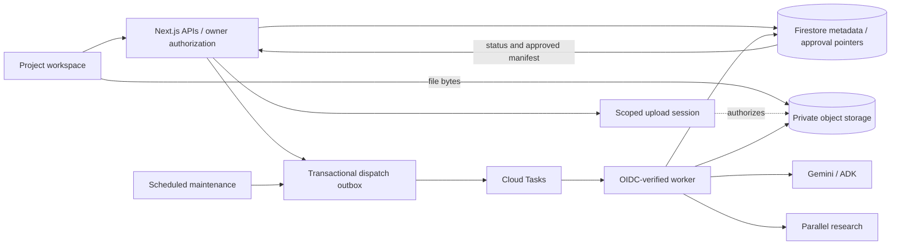

# Post-hackathon technical design

Status: implementation contract v1, 2026-09-06. Proposed names/paths below are new unless identified as existing.
Scope: [functional specification](functional-spec.md). Execution: [build checklist](build-checklist.md).

## 1. Architecture and boundaries

Keep one Next.js application on Cloud Run, Clerk, Firestore, Cloud Tasks, Gemini/ADK, and Parallel. Add a private Google Cloud Storage bucket for source files and immutable bulk outputs, a project-job queue to isolate pilot traffic from the demo, and an OIDC-authenticated scheduled maintenance trigger for dispatch reconciliation and cleanup. This is application infrastructure, not a Codex task automation.

Use server-only repositories as the authorization boundary for all public paths. `requireProjectAccess(projectId)` returns a verified actor and owned project; it cannot inherit the demo's unauthenticated development fallback. Tests use explicit injected actors. Worker access uses verified service identity and persisted project/job relationships, never a user-supplied owner ID.

Introduce `/projects`, `/projects/new`, `/projects/[projectId]`, `/projects/[projectId]/script`, and `/projects/[projectId]/plans/[version]`. Keep the sample at `/demo`; redirect `/` to projects only when the feature is enabled. Existing demo APIs/cookies remain independent. No automatic migration of shared judge/browser data into real accounts.

## 2. Data contracts

Implement strict Zod schemas in `lib/projects/schemas.ts`, `lib/scripts/schemas.ts`, and `lib/planning/schemas.ts`. Use independent numeric `schemaVersion: 1`; `fixtureVersion` stays demo-only. IDs are server-generated UUIDs, source block IDs are stable within an upload, and timestamps are Firestore timestamps at rest / ISO strings in public responses. Names below describe required fields; nullable fields are explicitly marked `?` here, meaning nullable rather than silently absent in persisted records.

| Entity and Firestore path | Required fields |
| --- | --- |
| `projects/{p}` | `id`, `ownerUserId`, `title`, `lifecycle: active/archived/deleting`, `recordVersion`, `planningInputsVersion`, `activeScriptVersionId?`, `acceptedSceneRevisionId?`, `approvedPlanVersion: integer >= 0`, `approvedManifestId?`, `activeJobId?`, `pendingUploadId?`, `writeEpoch`, `createdAt`, `updatedAt`. |
| `projects/{p}/inputs/{version}` | Immutable `version`, `countryCode`, `regionCode`, `currency`, `assumptions[]`, `budgetCeiling?`, `shootWindow?: {start,end}`, `targetHoursPerDay?`, `supportProfileVersion`, `inputHash`, `createdAt`. |
| `projects/{p}/scripts/{s}` | `id`, `format: pdf/fdx`, `originalFilename`, `declaredBytes`, `objectRef?`, `status: uploading/validating/parsing/review_ready/failed/superseded`, `parserVersion?`, `sourceManifestRef?`, `pageCount?`, `blockCount?`, `currentReviewRevisionId?`, `uploadedBy`, `createdAt`. |
| `projects/{p}/sceneRevisions/{r}` | `id`, `scriptVersionId`, `parentRevisionId?`, `editVersion`, `status: draft/accepted`, `sceneManifestRef`, `sourceCoverage`, `warnings[]`, `acknowledgedWarningIds[]`, `acceptedBy?`, `acceptedAt?`, `createdAt`. |
| `projects/{p}/manifests/{m}` | Immutable once complete: `id`, `kind: initial/ripple`, `scriptVersionId`, `sceneRevisionId`, `planningInputsVersion`, `inputHash`, `basePlanVersion`, `artifactRefs` for all five artifacts, `evidenceRef`, `provenanceRef`, `validationVersion`, `contentHash`, `status: staging/complete`, `createdAt`. |
| `projects/{p}/plans/{version}` | Immutable approval record: `version >= 1`, `manifestId`, `predecessorVersion?`, `jobId`, `approvedBy`, `approvedAt`. |
| `projects/{p}/jobs/{j}` | `id`, `kind: parse/initial-plan/ripple/delete`, `status`, `inputs` snapshot, `projectWriteEpoch`, `requestHash`, `idempotencyKeyHash`, `retryOfJobId?`, `candidateManifestId?`, `approvedVersion?`, `failure?`, `createdAt`, `finishedAt?`. |
| `projects/{p}/jobs/{j}/steps/{step}` | `stage`, `batchIndex?`, `dependencyIds[]`, `status`, `attempt`, `executionToken?`, `leaseExpiresAt?`, `heartbeatAt?`, `outputRef?`, `inputHash`, `providerUsage`, `failure?`. |
| `projects/{p}/uploads/{u}` | `scriptVersionId`, server-selected staging object key, `status`, `expiresAt`, declared size/type, observed generation/bytes/hash, and protected upload-session reference. |
| `dispatchOutbox/{id}` | Project/job/step IDs, `deliveryGeneration`, deterministic `taskName`, `state: pending/sent`, `nextAttemptAt`, `attemptCount`. No screenplay payload. |
| `usageReservations/{id}`, `usageDaily/{scopeDate}` | Actor/project/global reservation scopes, accepted-start and cost ceilings, consumed/released amounts, reservation lifecycle. No raw prompts. |
| `projectTombstones/{p}` | Minimal `ownerUserId`, deletion operation ID, fenced `writeEpoch`, cleanup status, timestamps/expiry; no title, screenplay, or plan content. Lives outside the subtree being deleted. |

`Job.inputs` is a discriminated union: parse holds script ID and finalized object generation; initial holds accepted scene revision, immutable planning inputs and hash with `basePlanVersion: 0`; ripple adds approved manifest/version, scene ID and request text; delete holds the tombstone epoch. Common schemas enforce project-local references and immutable snapshots. Draft/impact data is in the candidate manifest/provenance objects, not embedded in job records.

`ParsedScene` bulk records: `id`, `ordinal`, `displayNumber: string|null`, `originalHeading`, `reviewedHeading`, `setting: interior/exterior/interior-exterior/unknown`, `storyLocation`, `timeOfDay: day/night/dawn/dusk/other/unknown`, `sourceSpans[]`, `warningIds[]`, `predecessorSceneIds[]`. Each span uses block IDs plus character offsets; source blocks retain PDF page/order/bounds or FDX paragraph index. Full text belongs to source blocks; summaries/requirements belong to generated breakdown artifacts. Corrections produce a new immutable scene manifest; editing advances the draft pointer with `editVersion` compare-and-swap.

`ProductionArtifacts` retain the five existing concepts but use product schemas: source-linked scene requirements, complete schedule, budget band, location candidates, and archetype casting. No fixed production, region, currency, or minimum cast requirement. Preserve unknown source facts instead of coercing them to day/interior. Initial budgets omit deltas; ripple impact metadata derives differences from the base version. Initially require one shooting-day allocation per scene; the feasibility gate must amend this contract before implementation if multi-day allocations are needed. Every accepted scene must remain represented, every reference must resolve, and infeasible hard constraints block readiness.

`ObjectRef` is server-only `{key, generation, sha256, bytes, contentType}` against one configured bucket. Never accept arbitrary buckets, URLs, or object paths from clients. Store source/bulk JSON under server-selected project prefixes with unique keys and generation-bound reads. Page/scene pagination returns only authorized slices.

## 3. API contracts

All public project endpoints require Clerk access plus owner authorization, return `Cache-Control: private, no-store`, and recheck ownership for nested resources. Same-origin validation applies to browser mutations. Owner/identity never comes from request JSON. Use cursor pagination with bounded page size for projects, scenes, history, and jobs.

| Method/path (`P = /api/projects/{projectId}`) | Input → response |
| --- | --- |
| `GET /api/projects`, `POST /api/projects` | List owned projects; or `{title, planningInputs}` → `201 {project}`. |
| `GET P`, `PATCH P` | Snapshot; or `{expectedRecordVersion, title?, lifecycle?: active/archived, planningInputs?}` → updated project. Validate editing/archival restrictions. |
| `DELETE P` | `{expectedRecordVersion, confirmationTitle}` → `202 {deletionJobId}` after tombstoning. |
| `GET /api/project-deletions/{projectId}` | Owner-authorized tombstone status only; remains available while project content and nested job records are removed. |
| `POST P/uploads` | `{filename, bytes, format, expectedRecordVersion}` → `201 {uploadId, scriptVersionId, uploadSession, applicationExpiresAt}`. |
| `GET P/uploads/{u}`, `POST P/uploads/{u}/complete` | Read state/resume authorization; or finalize server-selected object → `202 {jobId, statusUrl}`. |
| `GET P/scripts/{s}/source` | Bounded source blocks or authenticated original download; no raw FDX inline execution. |
| `GET P/scene-revisions/{r}/scenes` | Paginated scenes, coverage, warnings, and edit version. |
| `POST P/scene-revisions/{r}/edits` | `{expectedEditVersion, operation}` where operation is rename-heading/label, split-at-source-position, merge-adjacent, restore-blocks → updated draft manifest/version. |
| `POST P/scene-revisions/{r}/accept` | `{expectedEditVersion, acknowledgedWarningIds}` → accepted immutable revision. |
| `POST P/scene-revisions/{r}/reopen` | `{expectedRecordVersion}` → new draft revision; supersedes any initial-plan proposal. |
| `POST P/initial-plans` | `{sceneRevisionId, planningInputsVersion, inputHash, expectedRecordVersion}` → `202 {jobId, statusUrl, eventsUrl}`. |
| `POST P/ripples` | `{basePlanVersion, sceneId, requestText}` → same job envelope. |
| `GET P/jobs/{j}`, `GET P/jobs/{j}/events` | Redacted snapshot / passive SSE with polling fallback. |
| `GET P/jobs/{j}/proposal` | Complete candidate artifacts, initial-review or ripple-impact metadata, evidence, warnings. |
| `POST P/jobs/{j}/retry` | `{expectedRecordVersion}` → new job linked by `retryOfJobId`; exact eligible inputs/checkpoints only. |
| `POST P/jobs/{j}/approve` | `{candidateManifestId, expectedBasePlanVersion, expectedInputHash}` → `{version, manifestId}`. |
| `POST P/jobs/{j}/discard` | Empty body → terminal discarded job; approved pointer unchanged. |
| `GET P/plans`, `GET P/plans/{version}` | Approved history / complete version projection. |
| `GET P/plans/{version}/export.pdf` | Authorized approved-version PDF. |
| `POST /api/internal/project-jobs/{p}/{j}/{step}/execute` | OIDC-verified task; resolve trusted step inputs from persistence. |
| `POST /api/internal/projects/maintenance` | Verified maintenance identity; bounded outbox/lease/cleanup reconciliation. |

Every state-creating mutation uses `Idempotency-Key: UUID`; scope keys by actor/project/operation plus a canonical request hash. Persist the original result. Same key/same payload returns it; same key/different payload is `409`. Approval also has job-level idempotency, so a later retry returns its originally approved version even after the project advances further. Versioned edits require explicit preconditions.

Errors use `{error:{code,message,retryable,baselineChanged:false,fieldErrors?}}`; deletion has its own status response. Use `401` signed out, generic `404` unknown/not owned, `409` stale/locked, `413` too large, `415` unsupported format, `422` invalid content/infeasible inputs, `429` quota, `503` recoverable infrastructure failure. Never return execution tokens, upload-session secrets except in the authorized upload flow, provider errors, raw prompts, or internal object refs.

## 4. Upload and parse lifecycle

1. Transactionally reserve `pendingUploadId` and create upload/script records. Before a new upload replaces a prior pre-baseline script, supersede its pending draft and clear acceptance; never replace an approved script.
2. Server initiates a resumable upload to a unique staging object with create-only semantics. Browser receives the session through an authenticated response. A resumable session URI is a bearer credential; never log it or treat the app's expiry as provider-side expiry. Reconcile/cancel abandoned sessions and clean late arrivals. See [Cloud Storage resumable uploads](https://docs.cloud.google.com/storage/docs/resumable-uploads).
3. Completion records the observed object generation and creates a validation/parse job; expensive hashing/extraction runs in the worker. Verify actual bytes, signature, declared type, resource limits, and object ownership. Read that exact generation; promote a verified immutable source copy before parsing output is accepted. Generation preconditions protect against overwrite/retry races. See [Cloud Storage preconditions](https://docs.cloud.google.com/storage/docs/request-preconditions).
4. Extract bounded ordered blocks using format adapters; reject XML DTD/external entities, embedded execution, malformed structures, encrypted PDFs, or unreadable pages. Do not execute embedded PDF content. Select exact parser packages/versions only after the deployment spike.
5. Segment scenes, calculate source coverage, and publish a review manifest with warnings. Deterministic source-position IDs are reused for parse retries; split/merge IDs record predecessors. Complete the parse job and clear its lock; the draft review becomes editable.

Use authenticated source streaming/preview so access can be revoked immediately. Browser mutation APIs carry metadata rather than entire uploads. The spike must measure upload-abuse limits and cleanup behavior; post-upload size rejection alone is not a transfer quota.

## 5. Durable generation and concurrency

Initial graph: per-scene/batch breakdown → shared role/location normalization → region-specific research → whole-project schedule → budget/locations/casting → whole-plan validation. Persist validated steps and dependencies. The pilot starts with one task per bounded step/batch; ADK handles model work within that step. Do not rely on in-memory ADK session state surviving a worker restart.

Job states: `queued → running → succeeded` for parse/delete, or `queued → running → proposal_ready → approved/discarded` for plans. `queued/running → failed`; active work/proposals may become `superseded` when deletion or valid pre-baseline input changes invalidate them. A proposal-ready plan job retains the project lock. Failed/superseded/discarded jobs release it conditionally only if they still own it.

Cloud Tasks can redeliver and does not guarantee task order; prerequisites and fenced writes must be checked in storage. See [Cloud Tasks issues and limitations](https://docs.cloud.google.com/tasks/docs/common-pitfalls). Claim a step transactionally with a lease and execution token; every checkpoint verifies token, project epoch, job state, and input hash. Duplicate completed-step delivery is a no-op. Dependency completion creates next-step outbox records atomically with its checkpoint. A bounded maintenance run redispatches unsent outbox items and recovers expired leases with a new delivery generation. Terminal jobs acknowledge delivery; transient failures use bounded backoff/retry. Nothing depends on SSE, refresh, or another user request.

Initial retries may reuse validated checkpoints only when script, input, schema, prompt/model configuration, and relevant evidence freshness are compatible. Otherwise rerun the invalidated dependency and descendants. Provider calls may repeat after an ambiguous timeout; guarantee single publication, not exactly-once provider billing. Reserve per-user/project/global budget before calls and reconcile actual usage; cap attempts and conservative allowance for uncertain calls.

Planning prompts receive typed source data as untrusted content. Only the research step may use the fixed research tool; it emits sanitized objective templates excluding raw screenplay text, dialogue, project titles, names, and confidential identifiers. Keep evidence caches project-scoped initially, keyed by region, normalized question, research-policy version, and expiry. No cross-project private cache or bundled fallback. Required missing evidence blocks readiness; unknown citation IDs are rejected rather than silently replaced with every available source.

## 6. Atomic approval across object storage and Firestore

No cross-service transaction is assumed. Workers stage immutable outputs and run size, schema, coverage, reference, evidence, and planning-constraint gates. Publish a complete immutable Firestore manifest only after all referenced objects exist, match hashes/generations, and validate. Staging is not an approved plan.

Approval reads the project, job, complete manifest, accepted scene revision, and immutable inputs in one Firestore transaction. Check ownership, lifecycle/epoch, lock ownership, input hash, base version, `job.status === proposal_ready`, and exact candidate-manifest ownership by that job. Initial approval requires version 0 and no approved pointer; ripple approval requires the exact current version/manifest. Write `plans/{n+1}`, update the project's approved pointer/version, mark the job approved with that version, and clear the lock atomically. No object/provider/task operations occur inside the transaction callback, which may run again. See [Firestore transactions](https://firebase.google.com/docs/firestore/manage-data/transactions).

Readers resolve one approved manifest and never mix artifact versions. GC never removes referenced approved objects; it sweeps only abandoned staging after a grace period. Keep each Firestore record below the existing application 700 KiB limit, including manifests and metadata; large scenes/evidence/artifacts are chunked objects. Never embed full before/after plans in the project or job document.

## 7. Implementation map and operations

| Area | New boundary / adaptation |
| --- | --- |
| Authentication | `lib/auth/require-project-access.ts`; reuse Clerk access policy but return verified actor. |
| Projects and state | `lib/projects/*`, `lib/firestore/project-state.ts`; extend transaction abstraction for scoped paths without broadening destructive cleanup. |
| Upload/parse/review | `lib/storage/*`, `lib/scripts/*`, `components/projects/*`, `components/scripts/*`. |
| Generation | `lib/planning/*`, `lib/agents/initial-plan.ts`, `lib/jobs/*`, project task dispatcher/reconciler. |
| Existing ripple/UI | Extract generic execution from `lib/agents/revision-ripple.ts`; use project adapters for dashboard/review. Prepared references live behind explicit demo execution, not scene-text matching. |
| Export | Adapt `lib/pdf/production-bible.tsx` to immutable project versions and initial/ripple provenance. |

New runtime configuration: feature flags for project reads/intake/workers, private bucket, project queue, maintenance identity, validated format limits, supported profiles, job/step timeouts, attempt limits, and account/project/global budgets. Values are finalized by the spike, not silently defaulted to unlimited. Pin dependencies and use the installed Next.js guides before implementing route/UI changes; the local Route Handlers and authentication guides were consulted for this design.

Use bucket-scoped IAM and public access prevention; only the application authorizes object access. Stage 0 determines whether parser resource isolation fits the current service; extract a parser worker service if measurements show interference with interactive traffic. Structured logs contain IDs/stages/timing/usage/error codes only. Required indexes include owner+lifecycle+updated time for project lists and state+next-attempt time for outbox scans.

Deletion first increments `writeEpoch`, sets `deleting`, clears locks, and supersedes jobs transactionally. Cleanup cancels upload sessions, drains/fences workers, removes nested documents and all project object generations, then sweeps late writes before completing; deleting a parent document alone is insufficient. Keep a minimal non-content tombstone long enough to reject delayed tasks. Maintenance also cleans expired uploads and abandoned staging. Validate actual soft-delete/backup retention and disclose it before release.

Rollback disables intake and new worker claims, preserves project reads/exports, and respects schema compatibility. Do not point an older binary at new schemas without compatible readers; the demo remains separately accessible.

## 8. Bounded decisions still requiring evidence

| Gate | Required output | Blocks |
| --- | --- | --- |
| G1: ingestion | Pinned FDX/PDF adapters, supported-format corpus, source coverage, XML/PDF resource limits, deployment measurements. | Parser implementation and advertised support. |
| G2: scale | Confirm/revise 20 MB / 150-page / 200-scene targets, text/block limits, object chunk sizes, step deadlines/concurrency, parser isolation. | Broad generation and pilot intake. |
| G3: planning | Validate US-NM/USD profile, hard/soft constraint behavior, one-day scene allocation suitability, three-script quality rubric and evidence relevance. | Complete-plan schema freeze and pilot generation. |
| G4: operations | Explicit spend ceilings, retry/maintenance timing, upload session expiry/cancellation, deletion/backup retention, alert thresholds. | Pilot deployment. |

Architecture, ownership, provenance, approval semantics, and API boundaries above are implementation defaults. Gates require recorded evidence and, if necessary, a narrow amendment to these documents; they do not require redesigning the entire application.
